# Shotlist — `black_sand`

**75.58 s · 30 fps · 1276x718 · 53 planos · plano medio 1.43 s · 0.69 cortes/s**  
Plano mas corto 1 frames · mas largo 157 frames.

> Generado por `tools/shotlist.py` desde `shots.json` (ffmpeg) + `anotaciones.json` (a mano).
> **Esta tabla es la fuente de verdad.** Si cambia un plano, se cambia aqui primero.

## Actos

| Acto | Planos | Idea |
|---|---|---|
| 1. Persecucion en el callejon | 1–13 | Alguien huye y alguien lo alcanza. Todavia no sabemos quien es quien. |
| 2. El trato | 14–23 | La bolsa de arena. Dos caras enfrentadas, la conversacion se rompe en golpe. |
| 3. La calle y el poder | 24–37 | El personaje ya domina el barrio. Aqui aparecen las onomatopeyas. |
| 4. Pelea nocturna | 38–48 | El jefe. El punetazo de arena. Clímax. |
| 5. Titulos | 49–53 | Nombre y logo. Se cobra todo lo anterior. |

## Planos

### 1. Persecucion en el callejon

| # | In | Out | Dur | Frames | Tipo | Camara | Sujeto | Accion | Transicion | Frame |
|---|---|---|---|---|---|---|---|---|---|---|
| **01** | 0.00 | 3.17 | 3.17 s | 95 | busto | travelling lateral, handheld | EL CORREDOR | corre gritando, las trenzas al viento | corte seco | 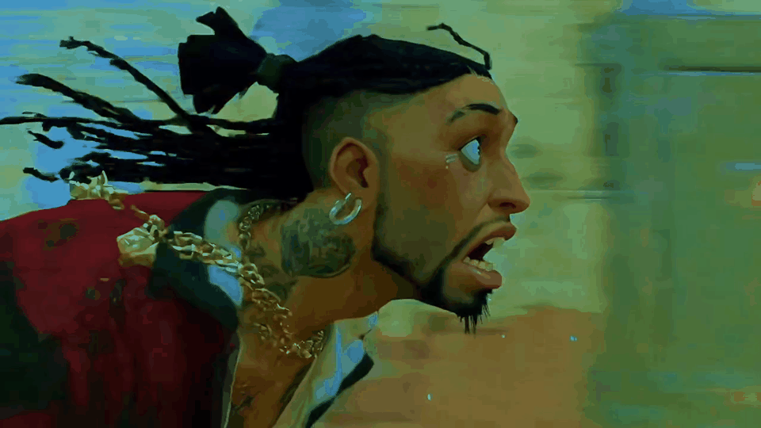 |
| **02** | 3.17 | 4.67 | 1.50 s | 45 | busto | handheld muy cerca, frontal | EL CORREDOR | mira atras aterrado | corte seco | 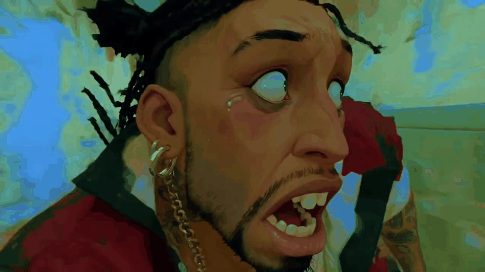 |
| **03** | 4.67 | 5.00 | 0.33 s | 10 | impacto | whip pan | pared del callejon | barrido de camara | barrido | 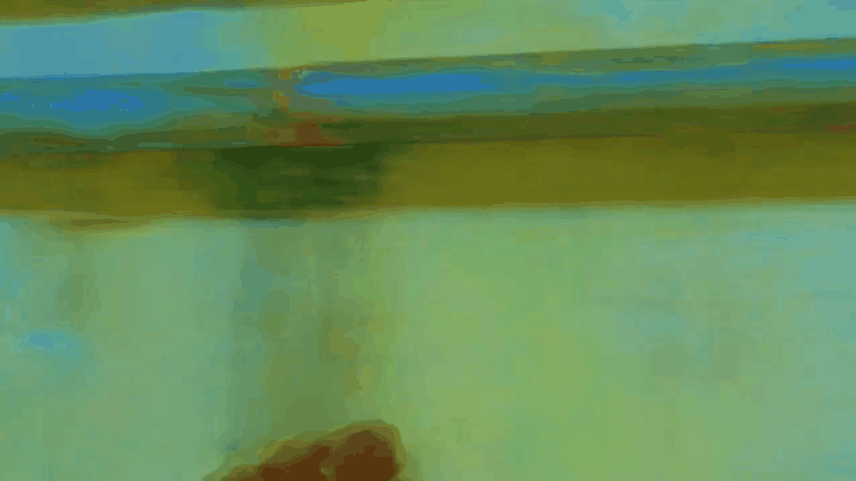 |
| **04** | 5.00 | 5.40 | 0.40 s | 12 | amplio | avance frontal por el callejon | UBICACION callejon | la puerta EXIT roja al fondo | corte seco | 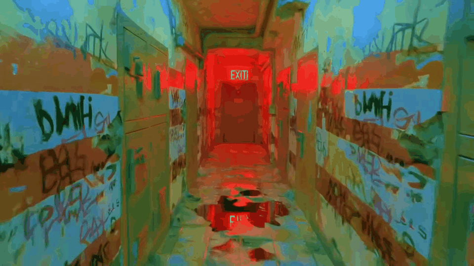 |
| **05** | 5.40 | 5.43 | 0.03 s | 1 | impacto | negro | - | 1 frame en negro | negro | 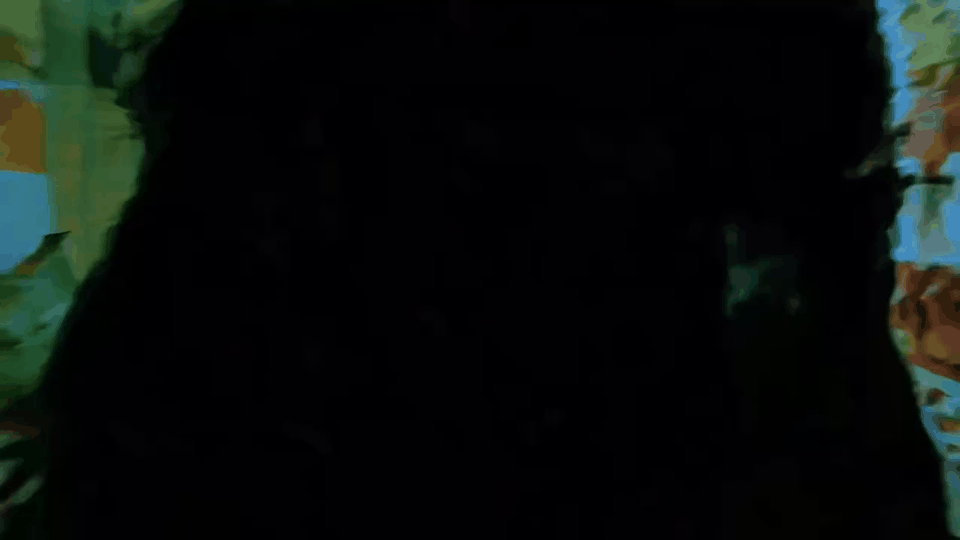 |
| **06** | 5.43 | 5.53 | 0.10 s | 3 | impacto | negro con silueta | - | 3 frames casi negros | negro |  |
| **07** | 5.53 | 7.20 | 1.67 s | 50 | amplio | contrapicado desde el suelo | UBICACION callejon | charco, grafiti y la puerta roja | corte seco | 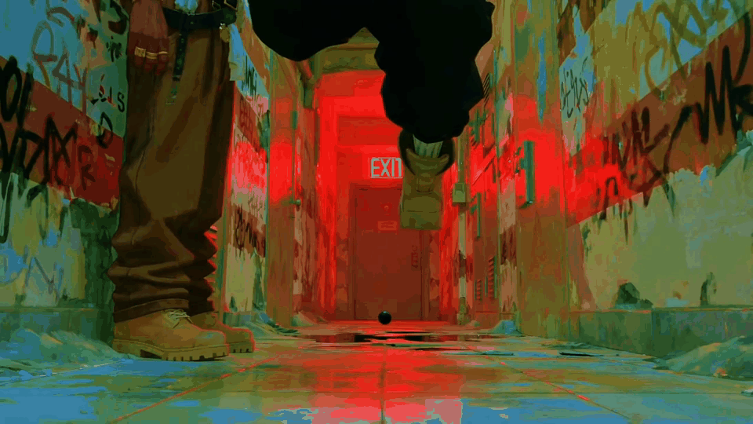 |
| **08** | 7.20 | 7.77 | 0.57 s | 17 | busto | fija, ligero picado | MARCO | mira hacia abajo, sin expresion | corte seco | 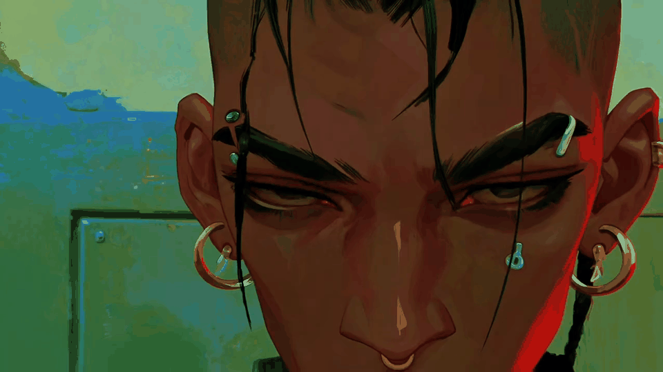 |
| **09** | 7.77 | 9.30 | 1.53 s | 46 | amplio | picado | EL CORREDOR | en el suelo mojado, la mano hacia camara | corte seco | 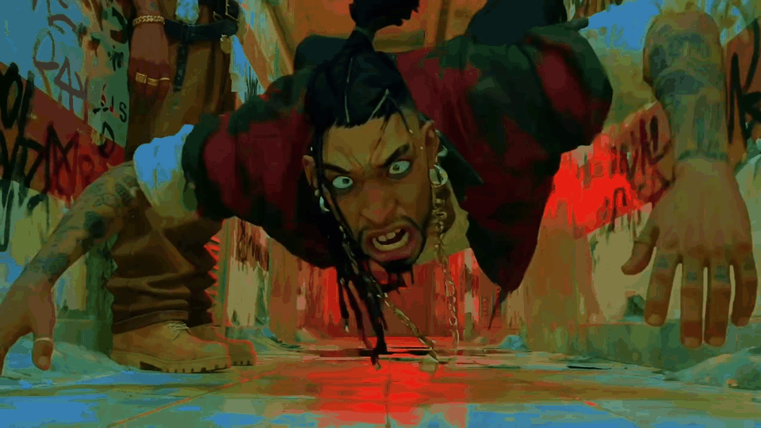 |
| **10** | 9.30 | 9.40 | 0.10 s | 3 | impacto | vineta comic | punos chocando | lineas de velocidad rojas y negras | corte seco | 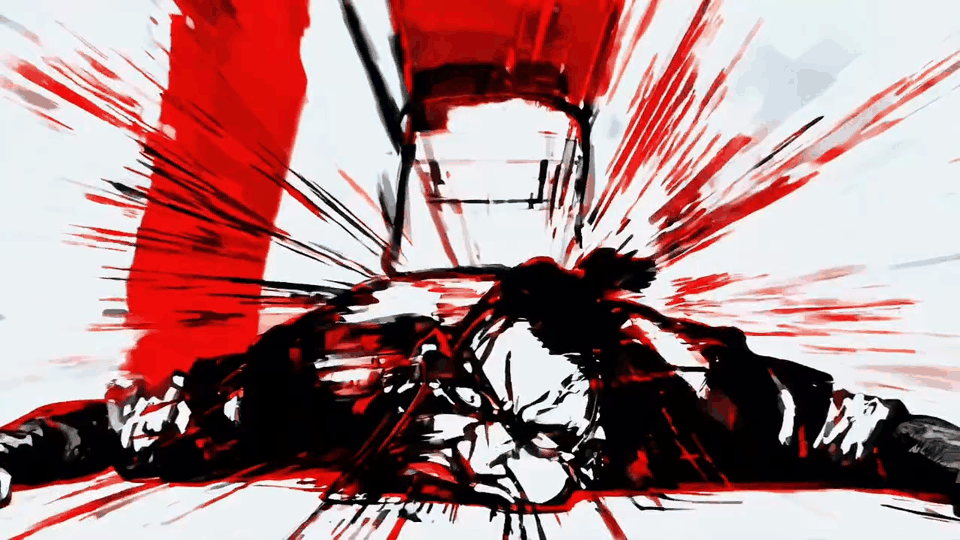 |
| **11** | 9.40 | 9.43 | 0.03 s | 1 | impacto | vineta comic | punos chocando | variante desplazada | corte seco | 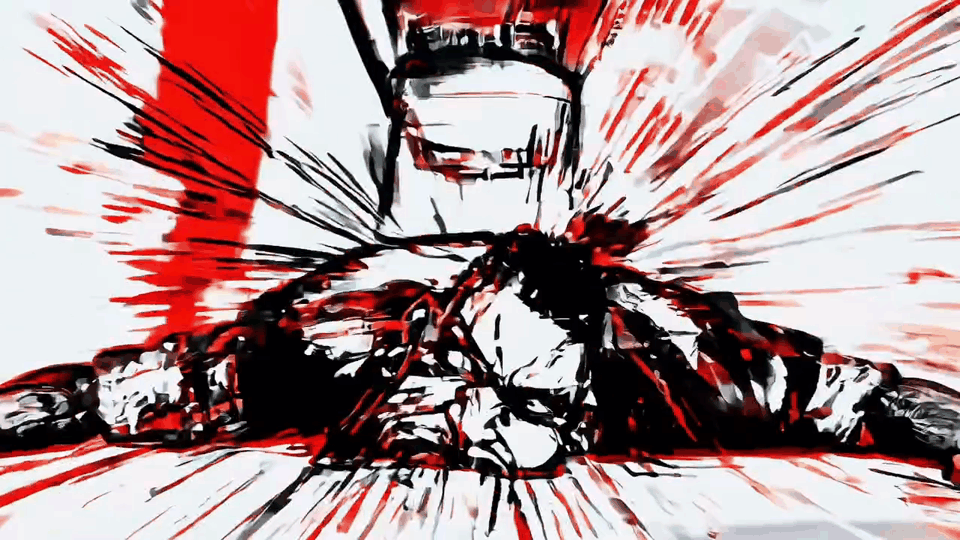 |
| **12** | 9.43 | 9.50 | 0.07 s | 2 | impacto | vineta comic | silueta sobre rojo | fondo rojo pleno | corte seco | 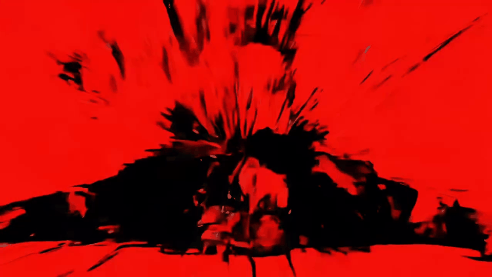 |
| **13** | 9.50 | 9.53 | 0.03 s | 1 | impacto | vineta comic | estallido | estallido blanco/negro/rojo | corte seco | 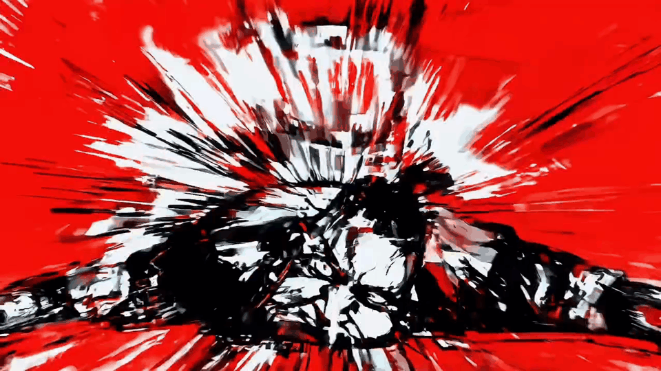 |

**Por que esta cada plano**

- **01** (95 f) — Empieza en mitad de la accion. Nadie explica nada.
- **02** (45 f) — Contraplano de miedo: instala que hay algo detras sin ensenarlo.
- **03** (10 f) — El barrido hace de corte. Tapa el salto de posicion.
- **04** (12 f) — Ensena el mundo en 0.4 s. Un solo plano de ubicacion, y muy corto.
- **05** (1 f) — Parpadeo. El negro de 1 frame funciona como un golpe de bateria.
- **06** (3 f) — Extiende el parpadeo lo justo para que se note.
- **07** (50 f) — Reinstala el espacio despues del negro, ya desde el suelo: alguien ha caido.
- **08** (17 f) — Primera aparicion del protagonista. Llega despues del caos, y quieto.
- **09** (46 f) — Cierra la persecucion: se resolvio fuera de cuadro.
- **10** (3 f) — Primera rafaga de comic. 3 frames.
- **11** (1 f) — 1 frame. La variacion minima es lo que hace que se lea como vibracion.
- **12** (2 f) — Invierte el fondo. Blanco-rojo-blanco: el ojo lo percibe como flash.
- **13** (1 f) — Cierra la rafaga de 4 vinetas en 0.3 s.

### 2. El trato

| # | In | Out | Dur | Frames | Tipo | Camara | Sujeto | Accion | Transicion | Frame |
|---|---|---|---|---|---|---|---|---|---|---|
| **14** | 9.53 | 12.17 | 2.63 s | 79 | macro | macro fija a contraluz | PROP bolsa de arena | la bolsa cuelga contra la luz | corte seco | 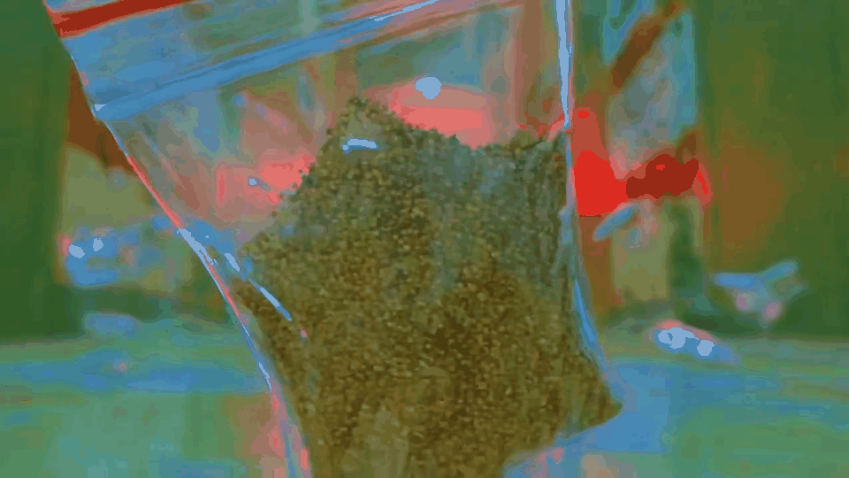 |
| **15** | 12.17 | 14.30 | 2.13 s | 64 | amplio | contrapicado bajo | MARCO (piernas y botas) | de pie sobre el charco | corte seco | 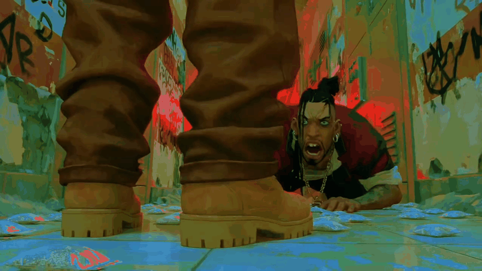 |
| **16** | 14.30 | 18.53 | 4.23 s | 127 | busto | fija, dos perfiles enfrentados | MARCO + EL CORREDOR | Marco ensena la bolsa | corte seco | 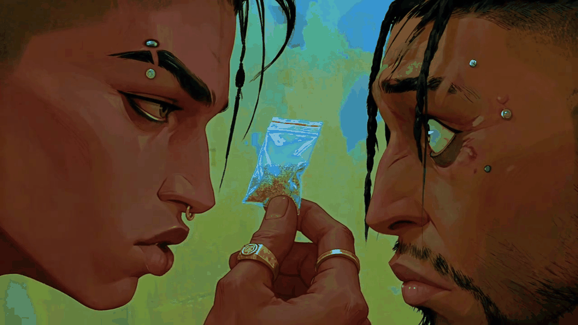 |
| **17** | 18.53 | 21.13 | 2.60 s | 78 | busto | fija, mismo eje | MARCO + EL CORREDOR | el otro grita, Marco no se mueve | corte seco | 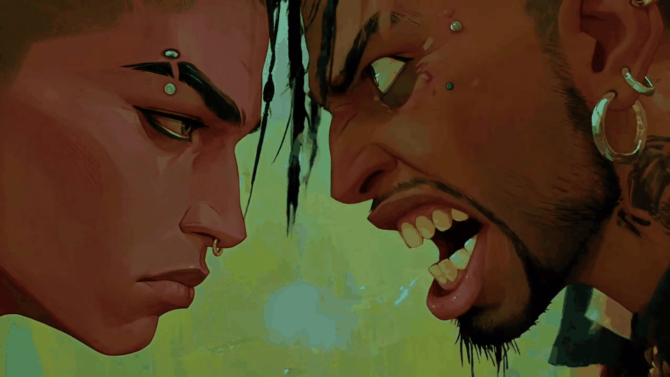 |
| **18** | 21.13 | 22.57 | 1.43 s | 43 | impacto | whip pan | pared | barrido verde y rojo | barrido | 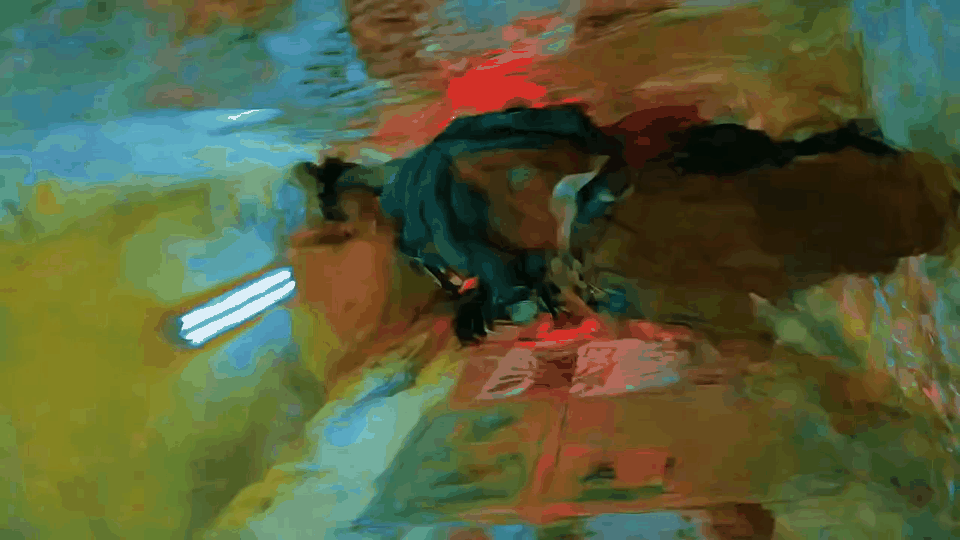 |
| **19** | 22.57 | 22.60 | 0.03 s | 1 | impacto | vineta comic | estallido | blanco/negro/rojo | corte seco |  |
| **20** | 22.60 | 22.63 | 0.03 s | 1 | impacto | vineta comic | estallido | variante | corte seco | 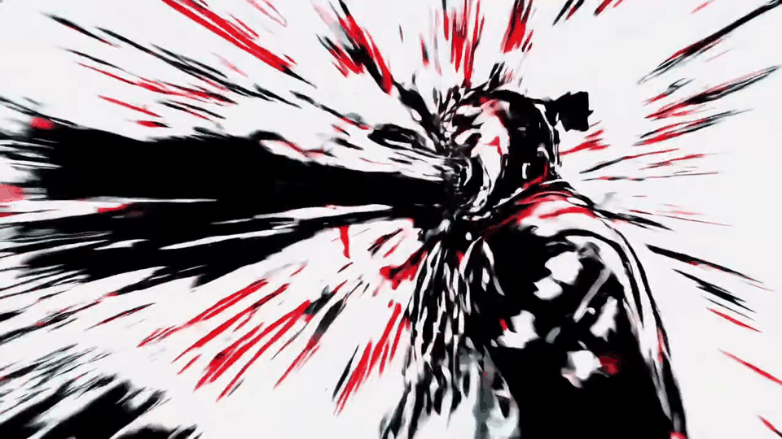 |
| **21** | 22.63 | 22.70 | 0.07 s | 2 | impacto | vineta comic | estallido | rojo pleno | corte seco | 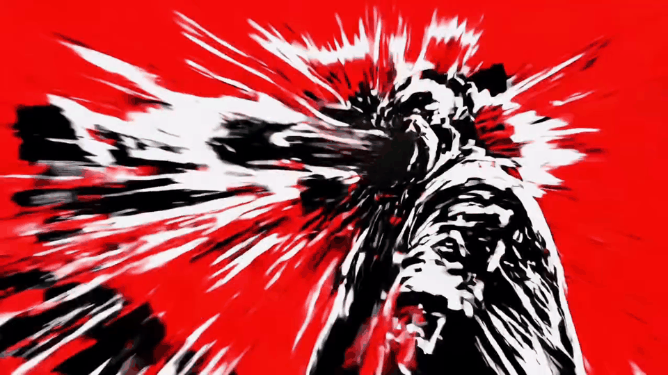 |
| **22** | 22.70 | 22.73 | 0.03 s | 1 | impacto | smear | arena negra | borron negro sobre verde | corte seco | 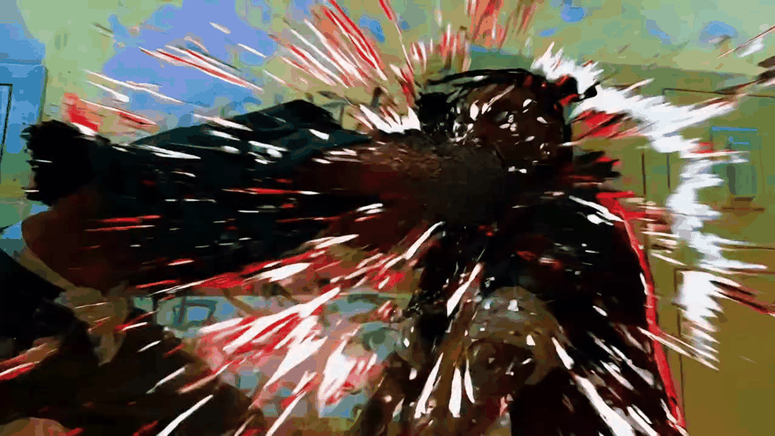 |
| **23** | 22.73 | 25.53 | 2.80 s | 84 | amplio | sigue el golpe | EL CORREDOR | sale despedido contra la pared | corte seco | 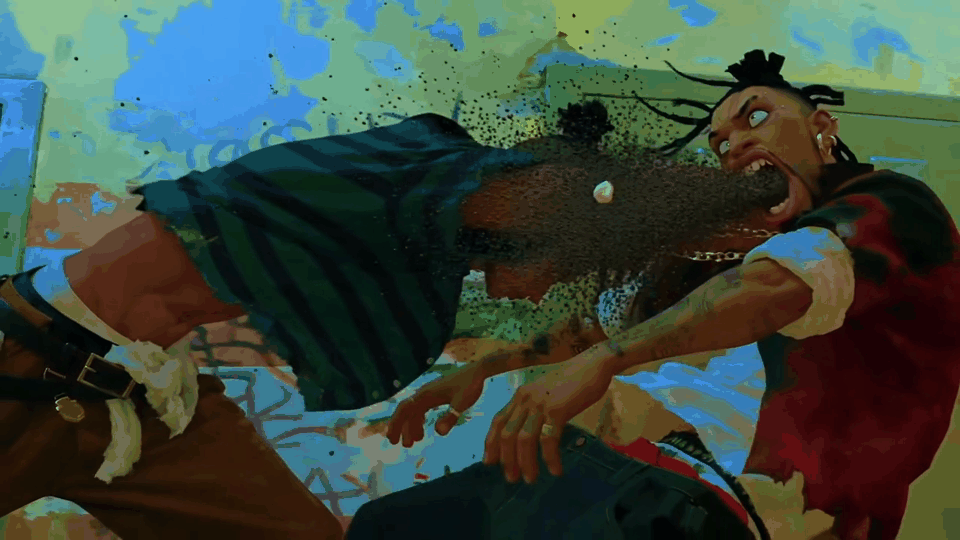 |

**Por que esta cada plano**

- **14** (79 f) — El objeto que da nombre a todo. Despues de 9 s de ruido, 2.6 s de quietud.
- **15** (64 f) — Poder por el encuadre: se le ve desde abajo y sin cara.
- **16** (127 f) — El plano mas largo del acto (4.2 s). Toda la trama cabe aqui.
- **17** (78 f) — Contraste de temperatura: uno estalla, el otro no.
- **18** (43 f) — Aviso de que viene el golpe.
- **19** (1 f) — 1 frame.
- **20** (1 f) — 1 frame.
- **21** (2 f) — 2 frames. Cuatro vinetas en 0.16 s: esto es el golpe.
- **22** (1 f) — El smear traduce el comic de vuelta a la animacion.
- **23** (84 f) — Consecuencia. Sin este plano el golpe no cuesta nada.

### 3. La calle y el poder

| # | In | Out | Dur | Frames | Tipo | Camara | Sujeto | Accion | Transicion | Frame |
|---|---|---|---|---|---|---|---|---|---|---|
| **24** | 25.53 | 27.77 | 2.23 s | 67 | busto | fija, aro dorado en primer termino | LA RUBIA | sonrie bajo la luz naranja | corte seco | 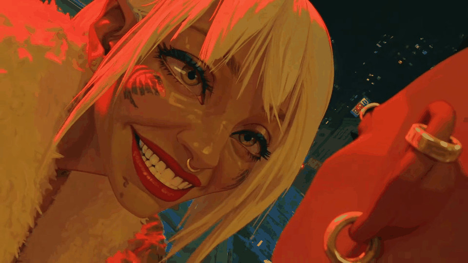 |
| **25** | 27.77 | 31.87 | 4.10 s | 123 | amplio | fija baja | MARCO (botas) + UBICACION calle | camina entre carros de la compra | corte seco | 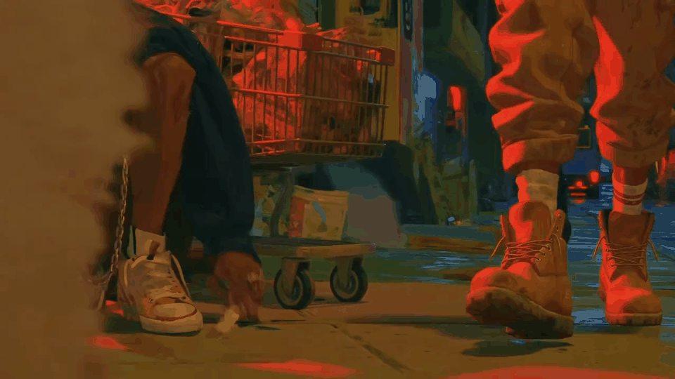 |
| **26** | 31.87 | 35.93 | 4.07 s | 122 | busto | fija de perfil | LA RUBIA | exhala humo hacia la calle azul | corte seco | 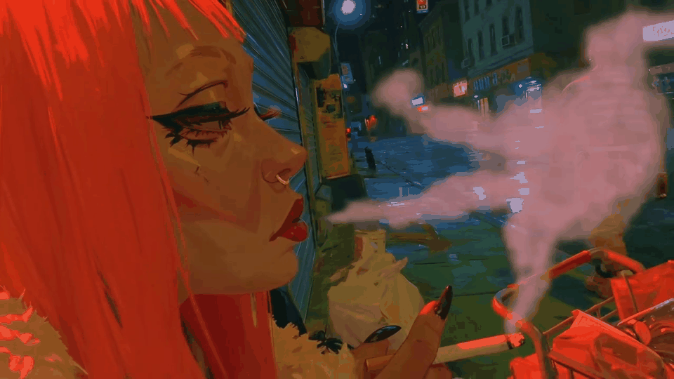 |
| **27** | 35.93 | 37.57 | 1.63 s | 49 | busto | fija, ligero contrapicado | MARCO | levanta el puno, la arena se dispara | corte seco | 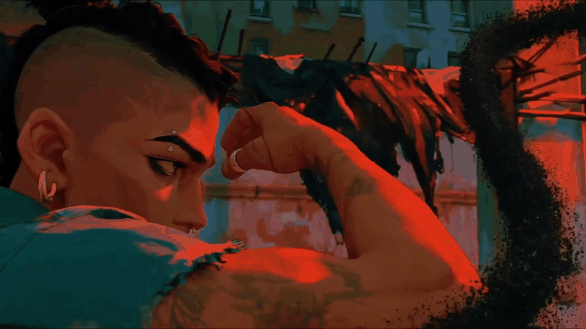 |
| **28** | 37.57 | 37.67 | 0.10 s | 3 | titulo | fija | TEXTO KRAK! | letras blancas sobre negro | corte seco | 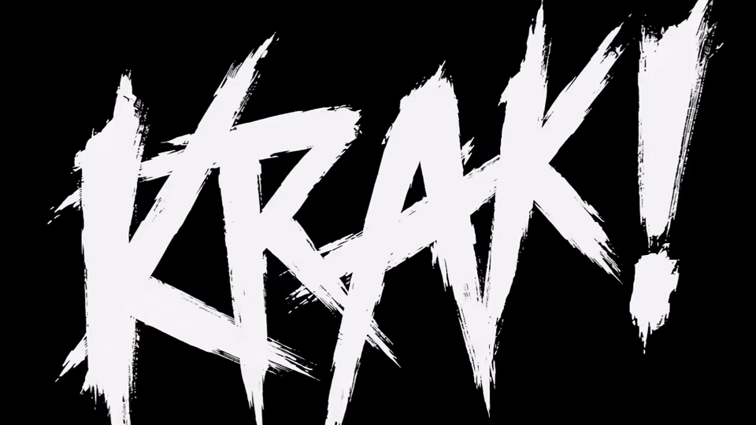 |
| **29** | 37.67 | 37.77 | 0.10 s | 3 | titulo | fija | TEXTO KRAK! | misma palabra, trazo distinto | corte seco | 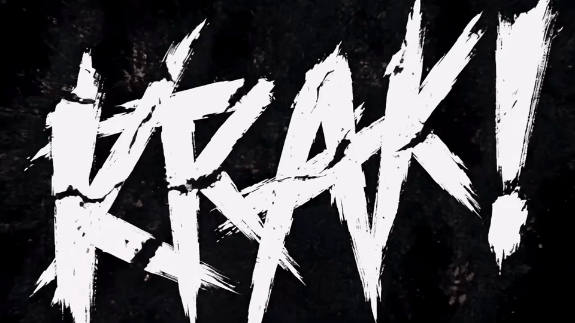 |
| **30** | 37.77 | 37.87 | 0.10 s | 3 | titulo | fija | TEXTO KRAK! | fondo crema con textura de papel | corte seco | 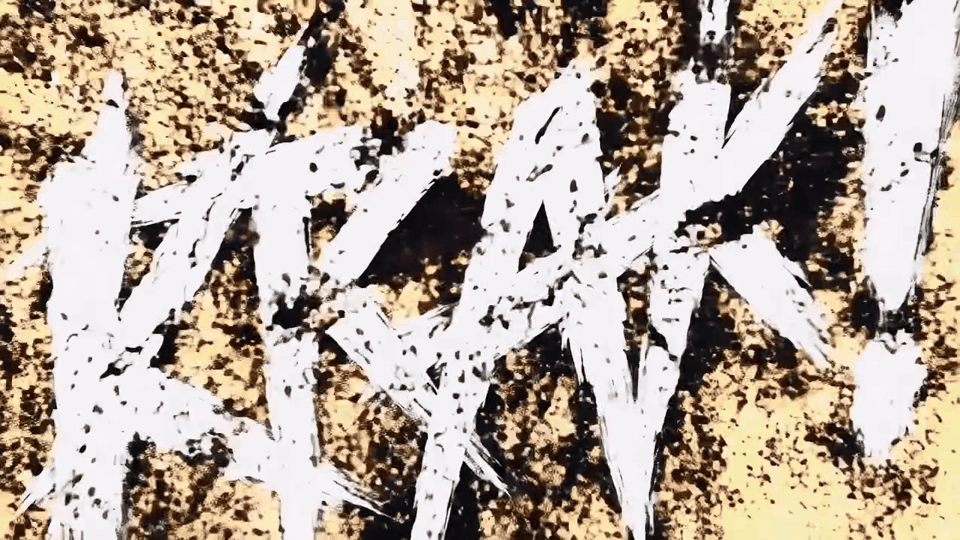 |
| **31** | 37.87 | 37.93 | 0.07 s | 2 | titulo | fija | TEXTO KRAK! | ultima variante | corte seco | 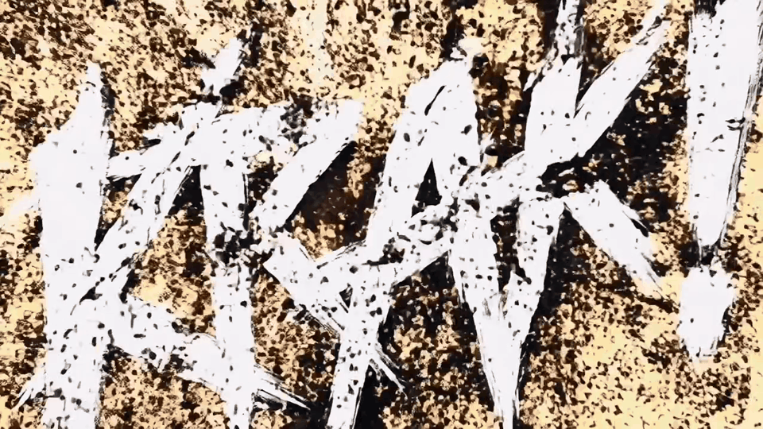 |
| **32** | 37.93 | 40.03 | 2.10 s | 63 | macro | macro fija | PROP arena negra + anillos | las manos se hunden en la arena | corte seco | 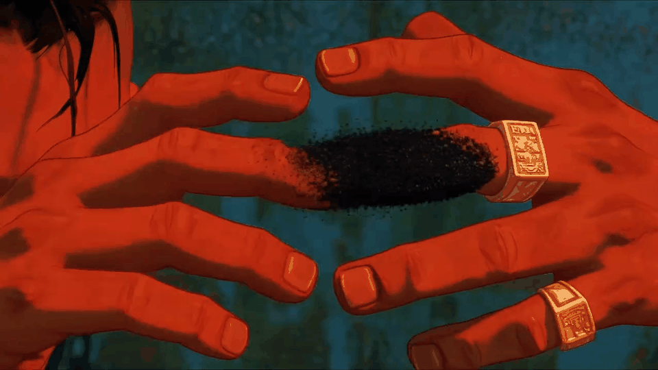 |
| **33** | 40.03 | 40.33 | 0.30 s | 9 | impacto | negro | - | 9 frames en negro | negro |  |
| **34** | 40.33 | 43.67 | 3.33 s | 100 | amplio | contrapicado nocturno | MARCO + UBICACION estructura | salta entre el andamiaje | corte seco | 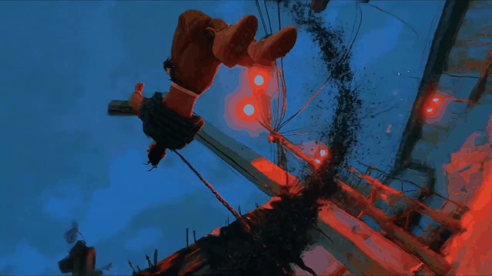 |
| **35** | 43.67 | 44.47 | 0.80 s | 24 | impacto | negro | - | 24 frames en negro | negro |  |
| **36** | 44.47 | 48.17 | 3.70 s | 111 | amplio | cenital | MARCO | circulo de arena visto desde arriba | corte seco | 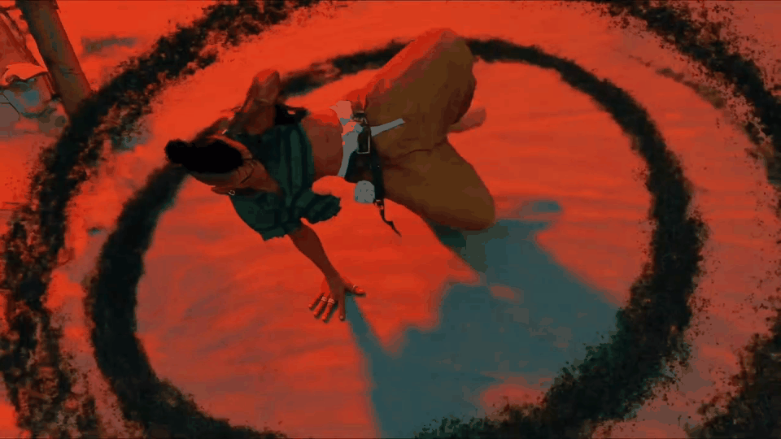 |
| **37** | 48.17 | 48.53 | 0.37 s | 11 | impacto | negro | - | 11 frames en negro | negro | 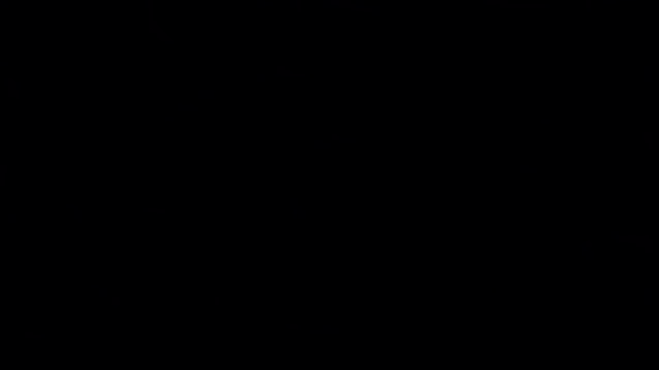 |

**Por que esta cada plano**

- **24** (67 f) — Cambio de acto por corte de color: de verde acido a naranja.
- **25** (123 f) — Ubicacion nueva contada otra vez desde el suelo. Es la firma del corto.
- **26** (122 f) — Respiro de 4 s. Prepara el contraste con la rafaga que viene.
- **27** (49 f) — Anticipacion: el golpe se ve venir un plano antes.
- **28** (3 f) — La onomatopeya sustituye al plano de impacto. 3 frames.
- **29** (3 f) — Redibujada, no desplazada. Eso es lo que la hace vibrar.
- **30** (3 f) — Invierte el fondo a mitad de la rafaga.
- **31** (2 f) — Cuatro dibujos en 0.37 s.
- **32** (63 f) — Explica el poder sin una linea de dialogo.
- **33** (9 f) — Negro largo: aqui separa secuencias, no golpea.
- **34** (100 f) — Cambia el mundo a noche y neon sin explicarlo.
- **35** (24 f) — Elipsis. El negro hace de transicion de tiempo.
- **36** (111 f) — Eco del cenital del derrape en el otro video: el circulo como firma.
- **37** (11 f) — Ultimo negro antes del clímax.

### 4. Pelea nocturna

| # | In | Out | Dur | Frames | Tipo | Camara | Sujeto | Accion | Transicion | Frame |
|---|---|---|---|---|---|---|---|---|---|---|
| **38** | 48.53 | 53.77 | 5.23 s | 157 | amplio | fija | UBICACION calle nocturna | una figura de espaldas frente a la persiana | corte seco | 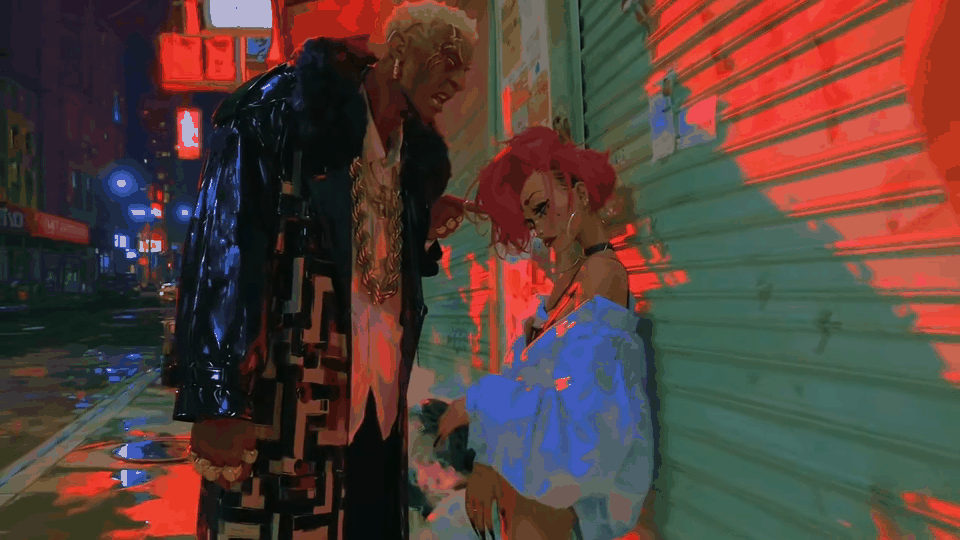 |
| **39** | 53.77 | 58.30 | 4.53 s | 136 | busto | fija, dos perfiles enfrentados | EL JEFE + MARCO | el jefe grita, Marco aguanta | corte seco | 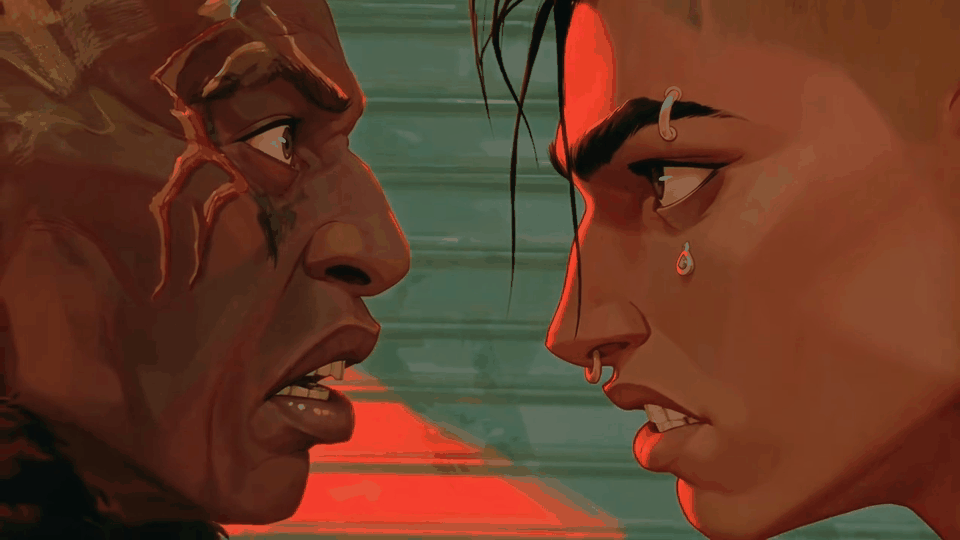 |
| **40** | 58.30 | 58.70 | 0.40 s | 12 | amplio | fija baja | MARCO (botas) | sube los escalones rojos | corte seco | 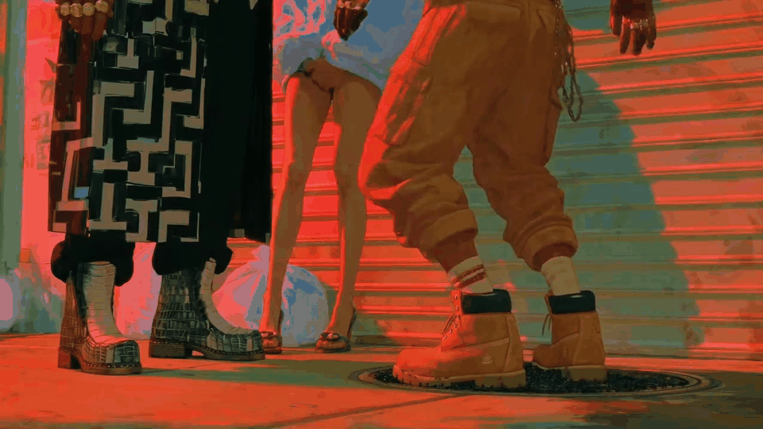 |
| **41** | 58.70 | 60.97 | 2.27 s | 68 | busto | fija de perfil | EL JEFE | el puno de arena entra en cuadro | corte seco | 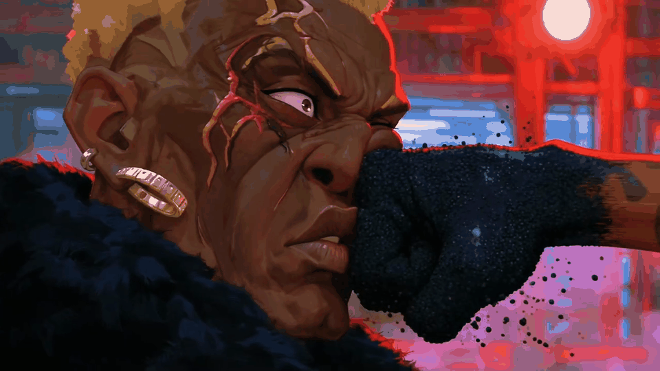 |
| **42** | 60.97 | 61.07 | 0.10 s | 3 | titulo | panel comic | TEXTO KRACK!! + EL JEFE | cara deformada, franja cian | corte seco | 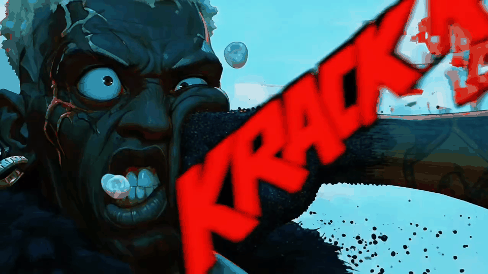 |
| **43** | 61.07 | 61.10 | 0.03 s | 1 | titulo | panel comic | TEXTO KRACK!! | variante | corte seco | 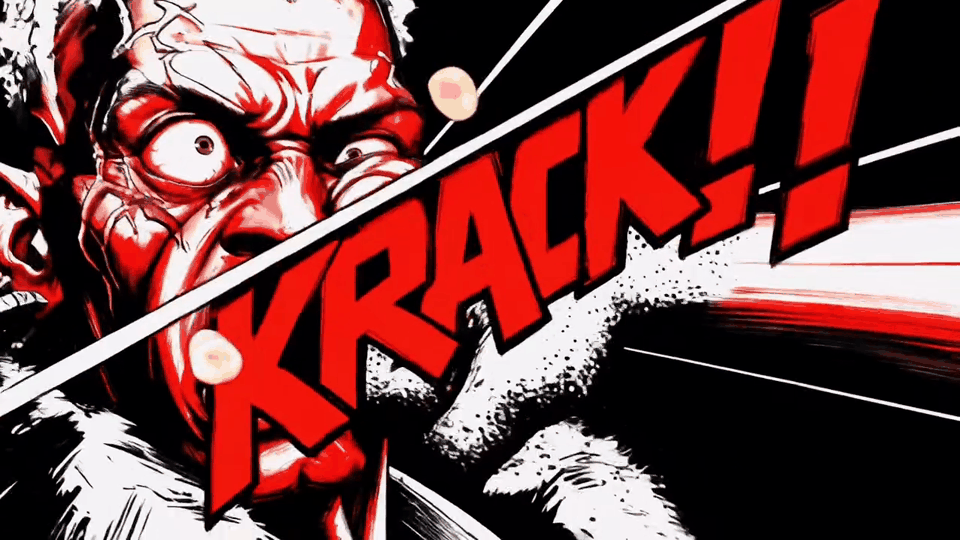 |
| **44** | 61.10 | 61.57 | 0.47 s | 14 | titulo | panel comic | TEXTO KRACK!! | el panel se sostiene | corte seco | 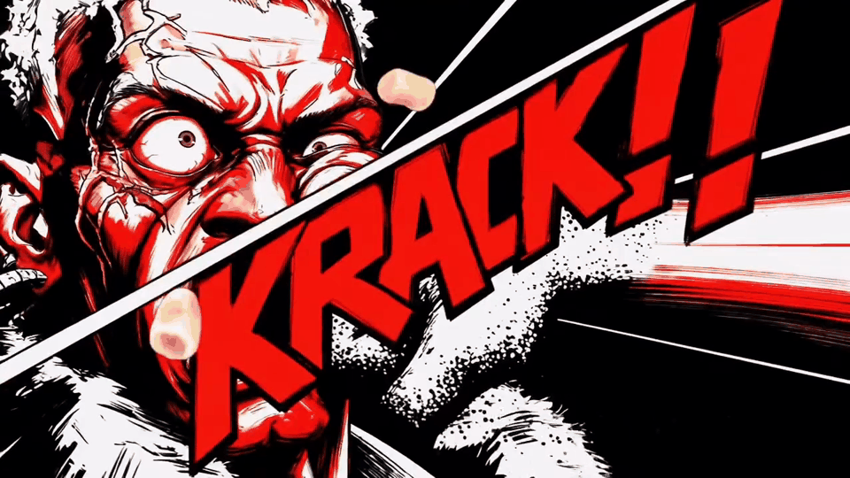 |
| **45** | 61.57 | 61.60 | 0.03 s | 1 | impacto | fija | EL JEFE | 1 frame de la cara golpeada | corte seco | 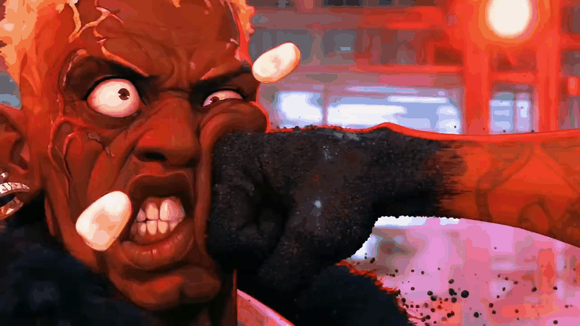 |
| **46** | 61.60 | 63.17 | 1.57 s | 47 | busto | fija | EL JEFE + MARCO | el puno de arena le entra en la boca | corte seco | 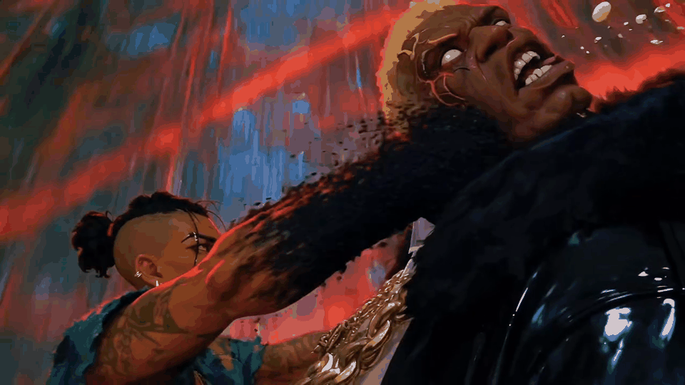 |
| **47** | 63.17 | 67.57 | 4.40 s | 132 | busto | fija | EL JEFE + MARCO | grita con la arena dentro | corte seco | 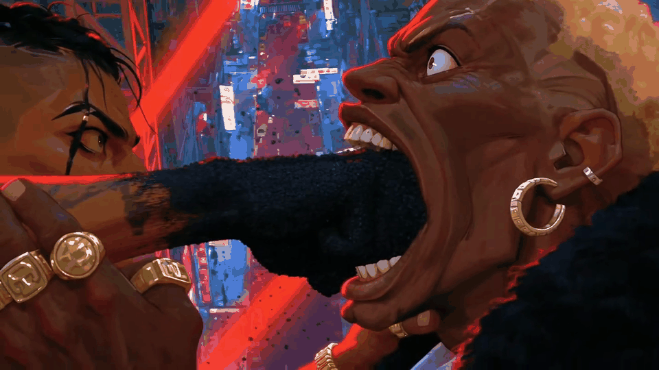 |
| **48** | 67.57 | 67.67 | 0.10 s | 3 | macro | macro desenfocado | PROP oro | 3 frames de dorado | corte seco | 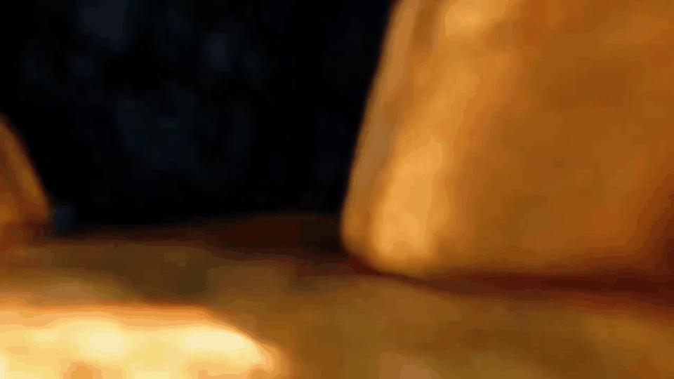 |

**Por que esta cada plano**

- **38** (157 f) — Plano mas largo del video (5.2 s). Baja el pulso a cero para poder subirlo de golpe.
- **39** (136 f) — Repite exactamente el encuadre del plano 16. La rima visual dice quien manda ahora.
- **40** (12 f) — Tercer plano de botas. Ya es un motivo.
- **41** (68 f) — El impacto empieza dentro del plano realista, no en la vineta.
- **42** (3 f) — Panel completo: dibujo + texto + color complementario. El cian es el unico frio del acto.
- **43** (1 f) — 1 frame.
- **44** (14 f) — 14 frames: el unico panel que se deja leer.
- **45** (1 f) — Vuelta al mundo real por un solo frame.
- **46** (47 f) — Ahora si se ve entero lo que la vineta habia insinuado.
- **47** (132 f) — 4.4 s: el plano se alarga para que el golpe duela.
- **48** (3 f) — Puente de color hacia los titulos.

### 5. Titulos

| # | In | Out | Dur | Frames | Tipo | Camara | Sujeto | Accion | Transicion | Frame |
|---|---|---|---|---|---|---|---|---|---|---|
| **49** | 67.67 | 71.50 | 3.83 s | 115 | titulo | fija | TEXTO BLACK SAND | el titulo sobre la estructura metalica | corte seco | 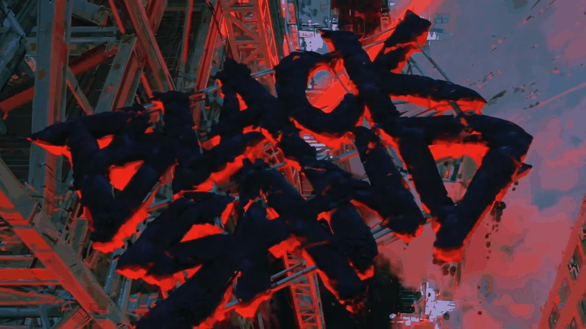 |
| **50** | 71.50 | 72.70 | 1.20 s | 36 | titulo | fija | TEXTO OZ | logo rojo sobre la calle desenfocada | corte seco | 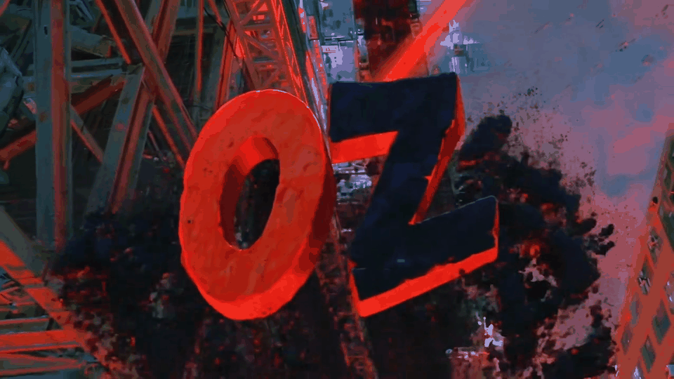 |
| **51** | 72.70 | 74.77 | 2.07 s | 62 | titulo | fija | TEXTO OZ | logo rojo sobre negro | corte seco | 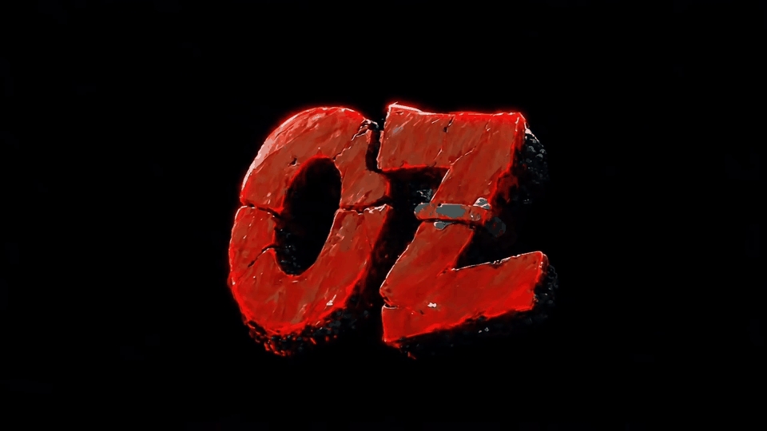 |
| **52** | 74.77 | 75.43 | 0.67 s | 20 | impacto | negro | - | negro con un punto de luz | negro | 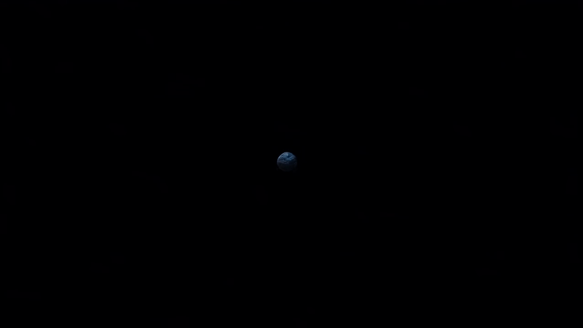 |
| **53** | 75.43 | 75.58 | 0.15 s | 4 | impacto | negro | - | negro | negro | 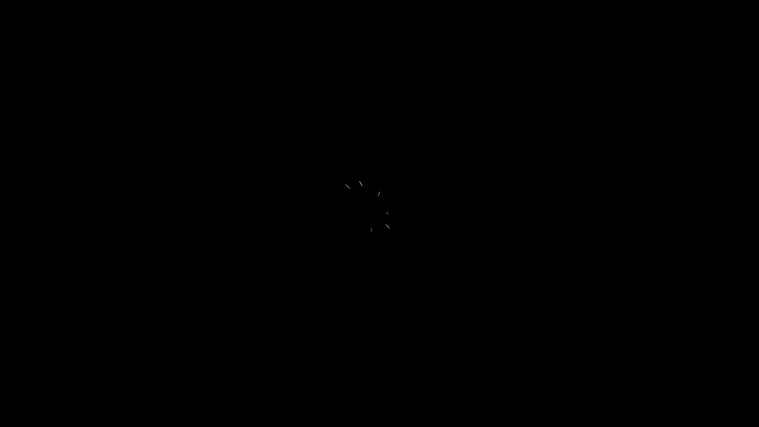 |

**Por que esta cada plano**

- **49** (115 f) — El nombre llega en el segundo 68 de 75. Se ha ganado antes.
- **50** (36 f) — Firma de estudio sobre imagen.
- **51** (62 f) — Misma firma, ya limpia.
- **52** (20 f) — Salida.
- **53** (4 f) — Fin.

## Reparto por tipo de plano

| Tipo | Planos | % del metraje | Duracion media |
|---|---|---|---|
| impacto | 18 | 6 % | 0.26 s |
| busto | 12 | 43 % | 2.73 s |
| amplio | 10 | 33 % | 2.53 s |
| titulo | 10 | 11 % | 0.81 s |
| macro | 3 | 6 % | 1.61 s |

## Patron de secuencia

El orden real en que se encadenan los tipos de plano:

```
busto → busto → impacto → amplio → impacto → impacto → amplio → busto → amplio → impacto → impacto → impacto → impacto → macro → amplio → busto → busto → impacto → impacto → impacto → impacto → impacto → amplio → busto → amplio → busto → busto → titulo → titulo → titulo → titulo → macro → impacto → amplio → impacto → amplio → impacto → amplio → busto → amplio → busto → titulo → titulo → titulo → impacto → busto → busto → macro → titulo → titulo → titulo → impacto → impacto
```

Los encadenados que mas se repiten:

- `impacto → impacto` — 9 veces
- `titulo → titulo` — 7 veces
- `impacto → amplio` — 6 veces
- `amplio → busto` — 6 veces
- `busto → busto` — 4 veces
- `amplio → impacto` — 4 veces
