# Shotlist — `on_the_road`

**39.01 s · 30 fps · 1276x718 · 28 planos · plano medio 1.39 s · 0.69 cortes/s**  
Plano mas corto 10 frames · mas largo 173 frames.

> Generado por `tools/shotlist.py` desde `shots.json` (ffmpeg) + `anotaciones.json` (a mano).
> **Esta tabla es la fuente de verdad.** Si cambia un plano, se cambia aqui primero.

## Actos

| Acto | Planos | Idea |
|---|---|---|
| 1. Diner del desierto | 1–4 | Quien es y donde esta. Se presenta por lo que come, no por lo que dice. |
| 2. Quemada de rueda y donuts | 5–13 | Que sabe hacer. El coche se convierte en el segundo personaje. |
| 3. Carretera y velocidad | 14–28 | A donde va. El corte se acelera hasta que solo quedan texturas. |

## Planos

### 1. Diner del desierto

| # | In | Out | Dur | Frames | Tipo | Camara | Sujeto | Accion | Transicion | Frame |
|---|---|---|---|---|---|---|---|---|---|---|
| **01** | 0.00 | 2.23 | 2.23 s | 67 | macro | fija, deriva minima | hamburguesa + boca del personaje | muerde la hamburguesa, el queso cede | corte seco | 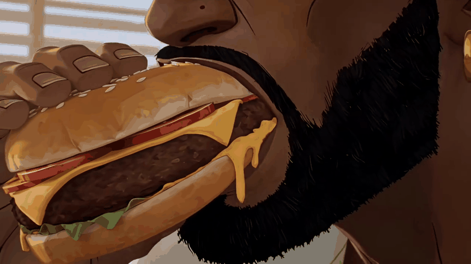 |
| **02** | 2.23 | 3.07 | 0.83 s | 25 | macro | fija, dolly in muy corto | vaso de refresco con hielo | la mano rodea el vaso, el hielo asienta | corte seco | 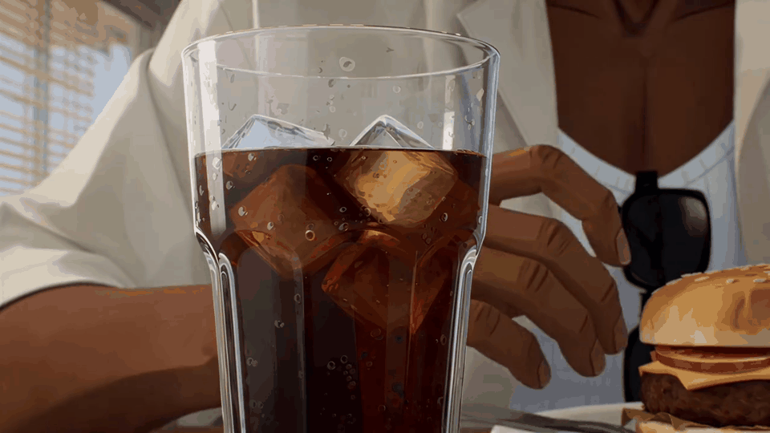 |
| **03** | 3.07 | 4.70 | 1.63 s | 49 | busto | fija, push in lento | PROTAGONISTA | mastica y mira fuera de cuadro, sin prisa | corte seco | 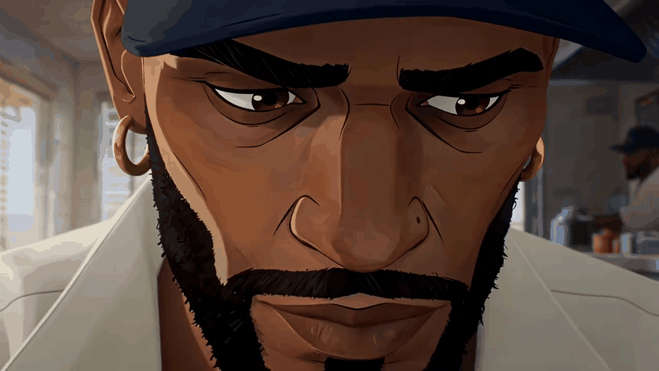 |
| **04** | 4.70 | 10.47 | 5.77 s | 173 | amplio | travelling lateral bajo, sigue los pies | PROTAGONISTA + UBICACION diner | camina del diner al coche | corte seco | 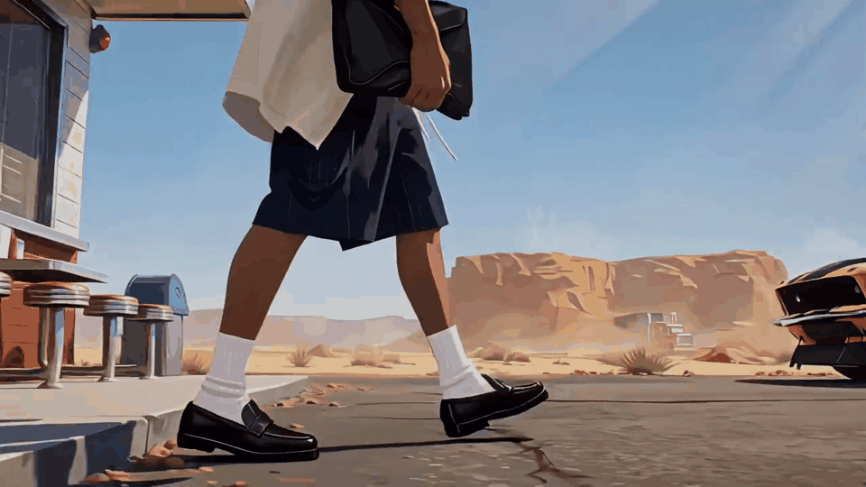 |

**Por que esta cada plano**

- **01** (67 f) — Abrir con textura, no con cara. El espectador entra por el apetito.
- **02** (25 f) — Segundo inserto: instala el ritual antes de mostrar al hombre.
- **03** (49 f) — Revelacion del personaje. Llega tarde a proposito: ya te importaba.
- **04** (173 f) — El plano mas largo del video (5.8 s). Ensena el mundo entero de una vez y deja respirar antes de acelerar.

### 2. Quemada de rueda y donuts

| # | In | Out | Dur | Frames | Tipo | Camara | Sujeto | Accion | Transicion | Frame |
|---|---|---|---|---|---|---|---|---|---|---|
| **05** | 10.47 | 10.80 | 0.33 s | 10 | busto | fija, fondo oscuro | PROTAGONISTA | gira la cabeza hacia el coche | corte seco | 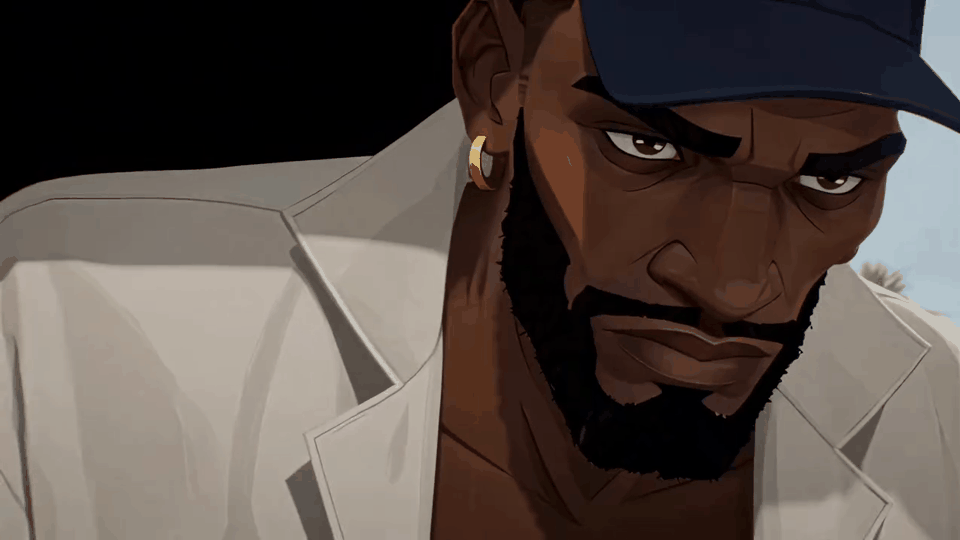 |
| **06** | 10.80 | 11.83 | 1.03 s | 31 | busto | fija desde el asiento del copiloto | PROTAGONISTA dentro del coche | se acomoda al volante | corte seco | 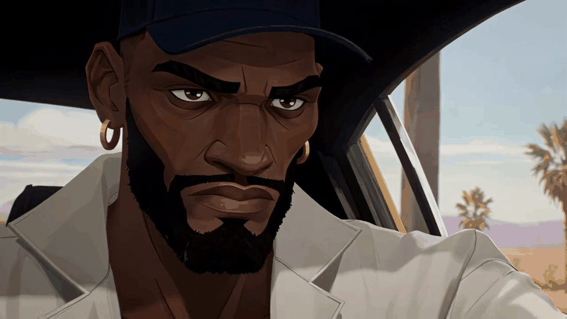 |
| **07** | 11.83 | 12.87 | 1.03 s | 31 | macro | macro fija | PROP llave de contacto | la mano gira la llave | corte seco | 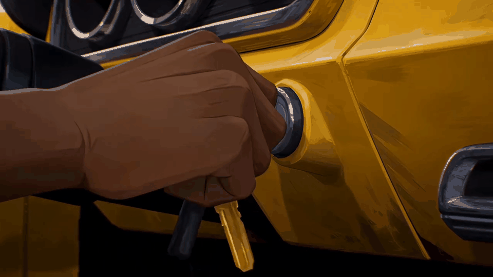 |
| **08** | 12.87 | 13.63 | 0.77 s | 23 | macro | macro fija | PROP cuadro de instrumentos | la aguja del cuentarrevoluciones sube | corte seco | 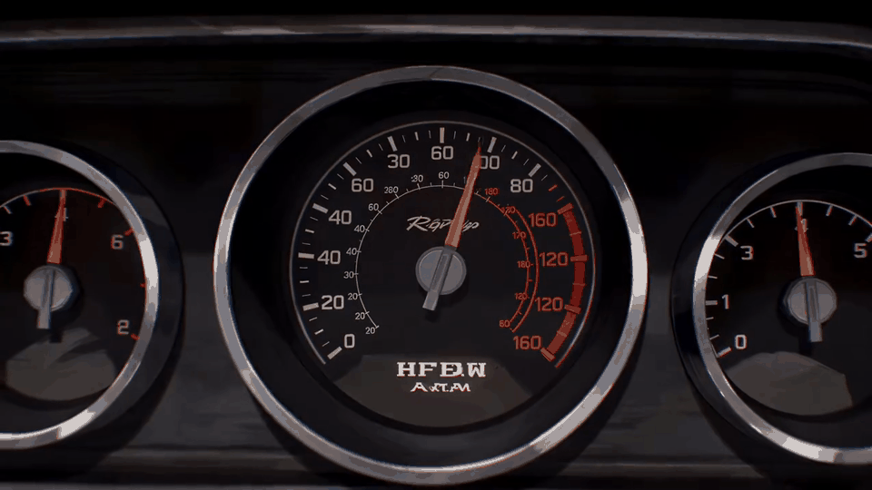 |
| **09** | 13.63 | 14.57 | 0.93 s | 28 | amplio | fija baja, trasera | COCHE | quemada de rueda parado, humo blanco | corte seco | 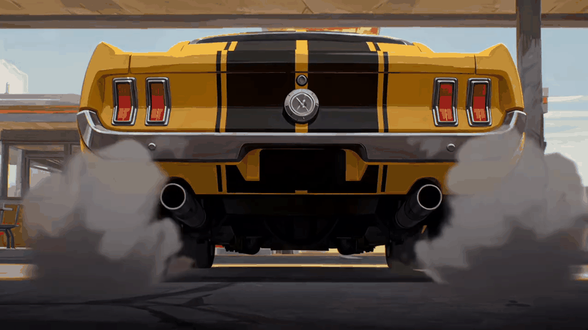 |
| **10** | 14.57 | 16.57 | 2.00 s | 60 | amplio | panoramica siguiendo el derrape | COCHE + UBICACION explanada | derrapa en circulo entre el humo | corte seco | 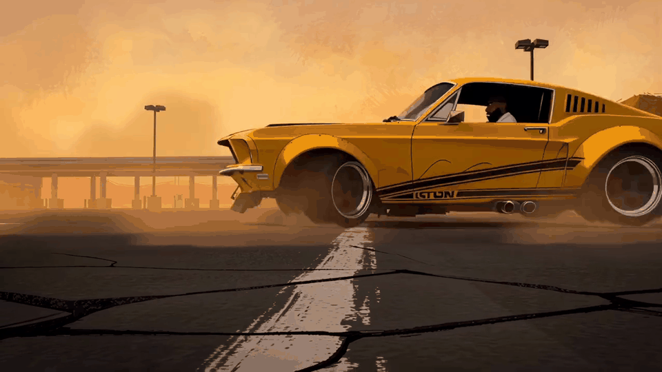 |
| **11** | 16.57 | 18.07 | 1.50 s | 45 | amplio | cenital, rotacion lenta | COCHE | dibuja el circulo de goma quemada | corte seco | 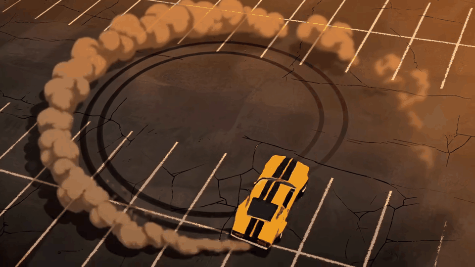 |
| **12** | 18.07 | 19.33 | 1.27 s | 38 | macro | fija baja pegada a la rueda | PROP rueda | la rueda gira, el humo pasa | corte seco | 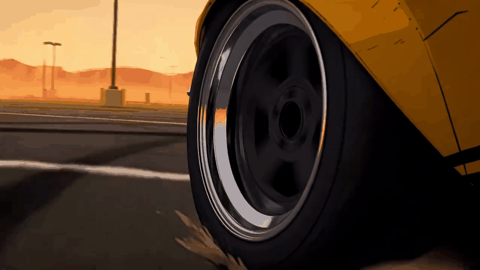 |
| **13** | 19.33 | 23.63 | 4.30 s | 129 | amplio | fija larga | COCHE + UBICACION explanada | sigue derrapando, ya pequeno en cuadro | corte seco | 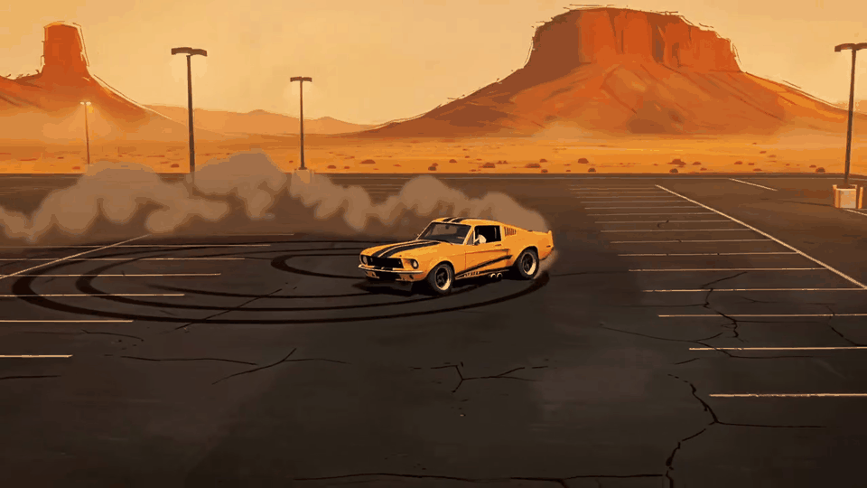 |

**Por que esta cada plano**

- **05** (10 f) — Pulso corto (0.33 s) que arranca el segundo acto.
- **06** (31 f) — Cambia el mundo: de fuera a dentro. Mismo rostro, nueva luz.
- **07** (31 f) — El gesto de arranque. Un inserto de mano vale mas que un plano del motor.
- **08** (23 f) — Traduce el sonido en imagen. Aqui es donde el montaje pide musica.
- **09** (28 f) — Primer estallido visual del video.
- **10** (60 f) — Ensena la accion completa una sola vez, para poder trocearla despues.
- **11** (45 f) — Cambio de eje radical. El cenital resetea la vista y evita que el derrape canse.
- **12** (38 f) — Inserto de textura entre dos planos amplios.
- **13** (129 f) — Cierra el acto dejando el coche lejos: el ojo descansa 4.3 s antes de la carretera.

### 3. Carretera y velocidad

| # | In | Out | Dur | Frames | Tipo | Camara | Sujeto | Accion | Transicion | Frame |
|---|---|---|---|---|---|---|---|---|---|---|
| **14** | 23.63 | 24.17 | 0.53 s | 16 | busto | fija sobre el retrovisor interior | PROTAGONISTA reflejado | mira atras un instante | corte seco | 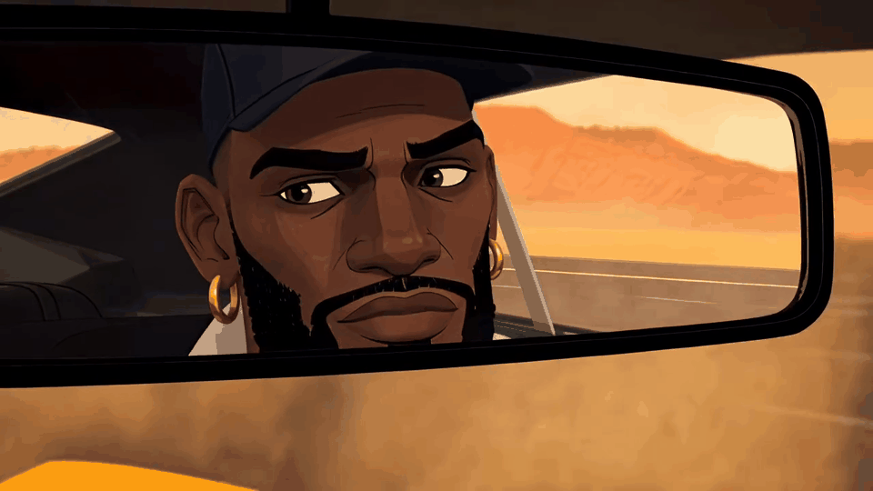 |
| **15** | 24.17 | 24.97 | 0.80 s | 24 | amplio | fija baja, el coche crece hacia camara | COCHE + UBICACION carretera | llega de frente por la carretera | corte seco | 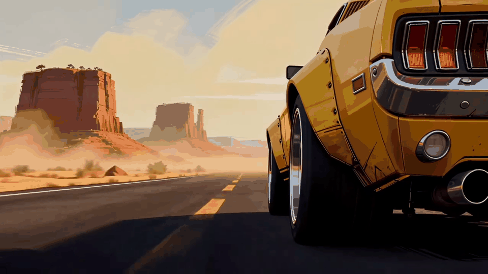 |
| **16** | 24.97 | 26.13 | 1.17 s | 35 | amplio | travelling lateral a la par | COCHE | corre de perfil levantando polvo | corte seco | 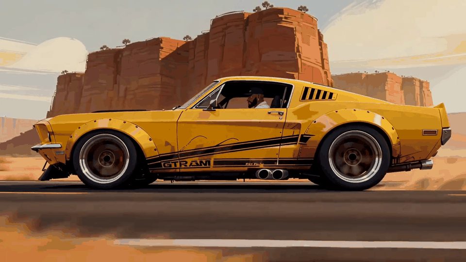 |
| **17** | 26.13 | 27.17 | 1.03 s | 31 | macro | travelling pegado a la carroceria | PROP rueda y aleta | la rueda gira a velocidad | corte seco | 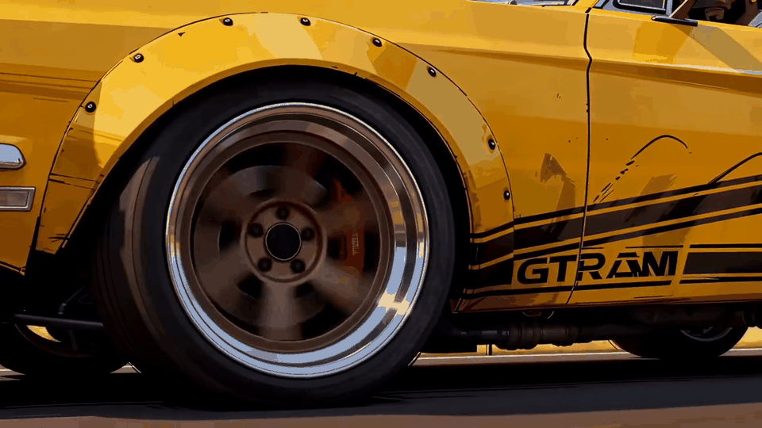 |
| **18** | 27.17 | 28.03 | 0.87 s | 26 | macro | fija trasera | PROP escapes | llamarada azul en los escapes | corte seco | 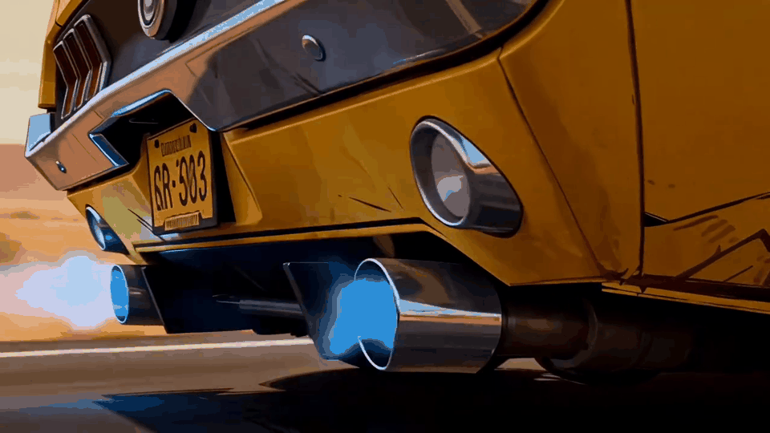 |
| **19** | 28.03 | 29.70 | 1.67 s | 50 | amplio | seguimiento desde atras | COCHE + trafico | adelanta entre un camion y una pickup | corte seco | 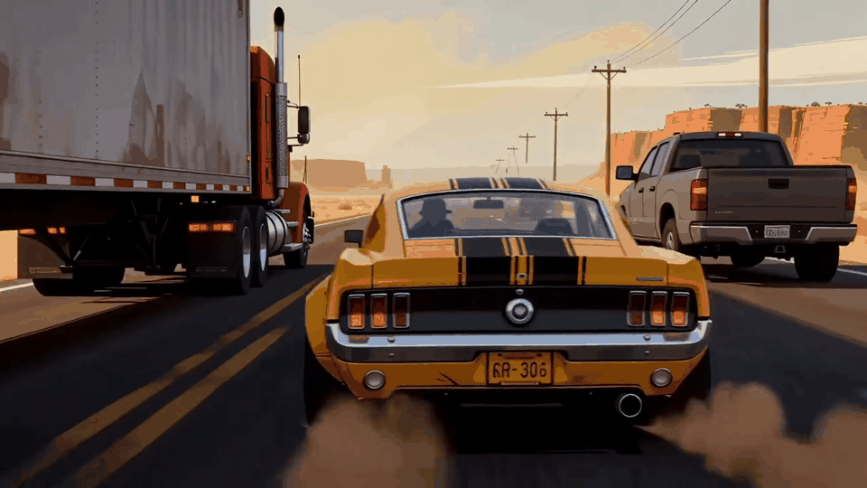 |
| **20** | 29.70 | 30.30 | 0.60 s | 18 | busto | fija sobre el retrovisor | PROTAGONISTA reflejado | mantiene la mirada al frente | corte seco | 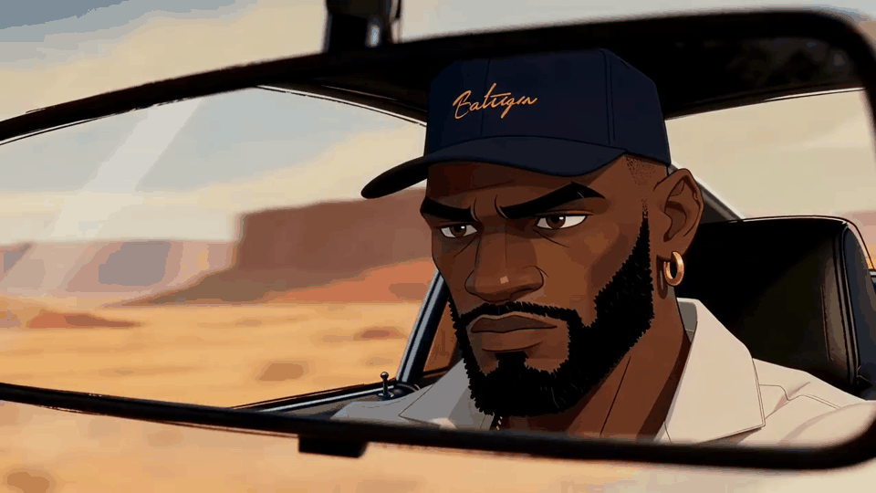 |
| **21** | 30.30 | 31.47 | 1.17 s | 35 | POV | fija dentro del coche, mirando al parabrisas | UBICACION carretera | la carretera entra bajo el coche | corte seco | 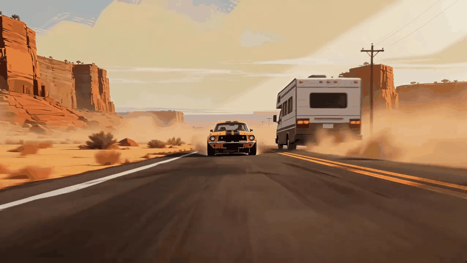 |
| **22** | 31.47 | 32.13 | 0.67 s | 20 | macro | macro fija | PROP volante y manos | las manos corrigen la trayectoria | corte seco | 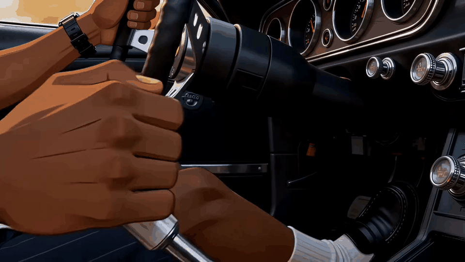 |
| **23** | 32.13 | 32.47 | 0.33 s | 10 | macro | travelling muy bajo junto a la rueda | PROP rueda | la rueda come asfalto | corte seco | 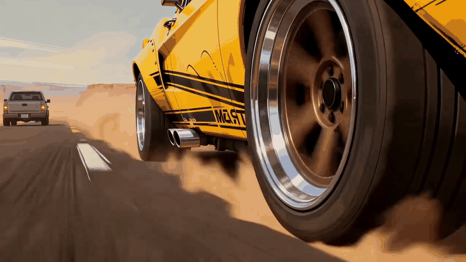 |
| **24** | 32.47 | 32.97 | 0.50 s | 15 | amplio | travelling frontal | COCHE | viene de frente a maxima velocidad | corte seco | 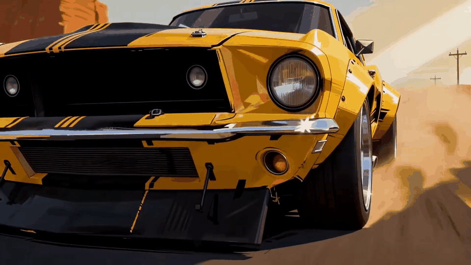 |
| **25** | 32.97 | 34.17 | 1.20 s | 36 | amplio | cenital alto (dron) | UBICACION carretera | dos coches diminutos en la recta | corte seco | 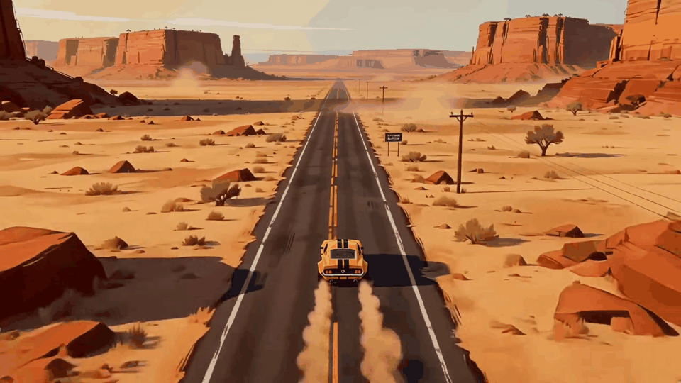 |
| **26** | 34.17 | 35.27 | 1.10 s | 33 | macro | macro fija | PROP velocimetro | la aguja pasa la marca | corte seco | 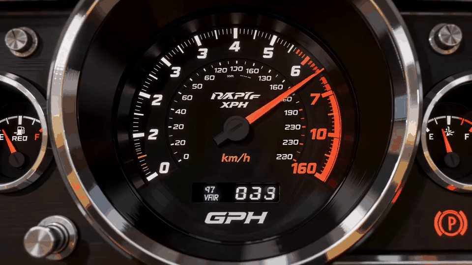 |
| **27** | 35.27 | 37.40 | 2.13 s | 64 | macro | travelling bajo a contraluz | PROP rueda contra el sol | la rueda gira contra el sol bajo | corte seco | 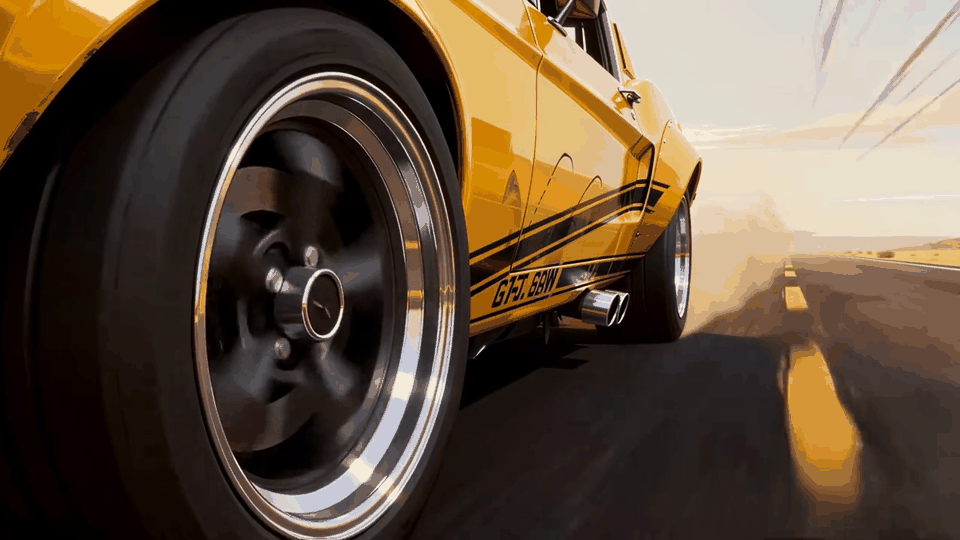 |
| **28** | 37.40 | 39.01 | 1.61 s | 48 | amplio | fija, el coche se aleja | COCHE + UBICACION carretera | se va hacia el sol levantando polvo | fundido a negro implicito | 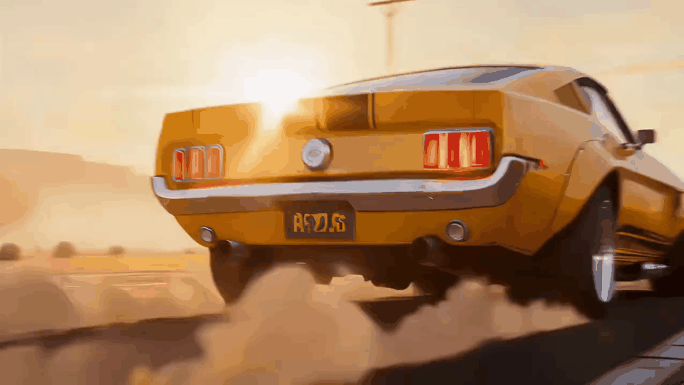 |

**Por que esta cada plano**

- **14** (16 f) — Truco de continuidad: el rostro vuelve enmarcado, sin gastar un plano de cara entero.
- **15** (24 f) — Establece el tercer mundo: mesetas rojas, asfalto, horizonte.
- **16** (35 f) — El plano de velocidad de referencia. Todo lo que viene lo trocea.
- **17** (31 f) — Detalle de fabricacion: el logo pintado vende que el coche existe.
- **18** (26 f) — Un color frio en medio de 15 s de naranja. Es el acento que despierta el ojo.
- **19** (50 f) — Mete riesgo: por primera vez hay algo mas en la carretera.
- **20** (18 f) — Segundo reflejo. Recordar la cara justo antes de que el montaje se vuelva abstracto.
- **21** (35 f) — Pone al espectador en el asiento. Un POV cada tanto ancla todo lo demas.
- **22** (20 f) — Devuelve el cuerpo al plano sin volver a la cara.
- **23** (10 f) — Plano de 10 frames. Aqui empieza la aceleracion del montaje.
- **24** (15 f) — Golpe de escala en medio de la rafaga.
- **25** (36 f) — Aire. Sin este plano la rafaga final agota.
- **26** (33 f) — El dato numerico. Cierra lo que abrio el cuentarrevoluciones del plano 8.
- **27** (64 f) — Empieza a disolver la imagen en luz: preparacion del final.
- **28** (48 f) — Plano final largo (1.6 s). Devuelve la respiracion y cierra.

## Reparto por tipo de plano

| Tipo | Planos | % del metraje | Duracion media |
|---|---|---|---|
| macro | 11 | 31 % | 1.11 s |
| amplio | 11 | 55 % | 1.95 s |
| busto | 5 | 11 % | 0.82 s |
| POV | 1 | 3 % | 1.17 s |

## Patron de secuencia

El orden real en que se encadenan los tipos de plano:

```
macro → macro → busto → amplio → busto → busto → macro → macro → amplio → amplio → amplio → macro → amplio → busto → amplio → amplio → macro → macro → amplio → busto → POV → macro → macro → amplio → amplio → macro → macro → amplio
```

Los encadenados que mas se repiten:

- `macro → macro` — 5 veces
- `macro → amplio` — 5 veces
- `amplio → amplio` — 4 veces
- `amplio → busto` — 3 veces
- `amplio → macro` — 3 veces
- `busto → amplio` — 2 veces
